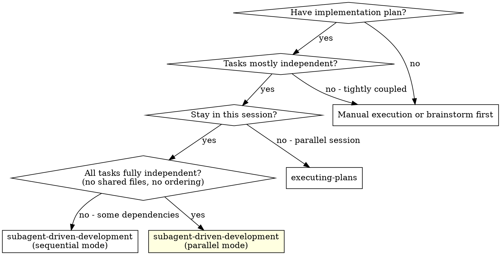
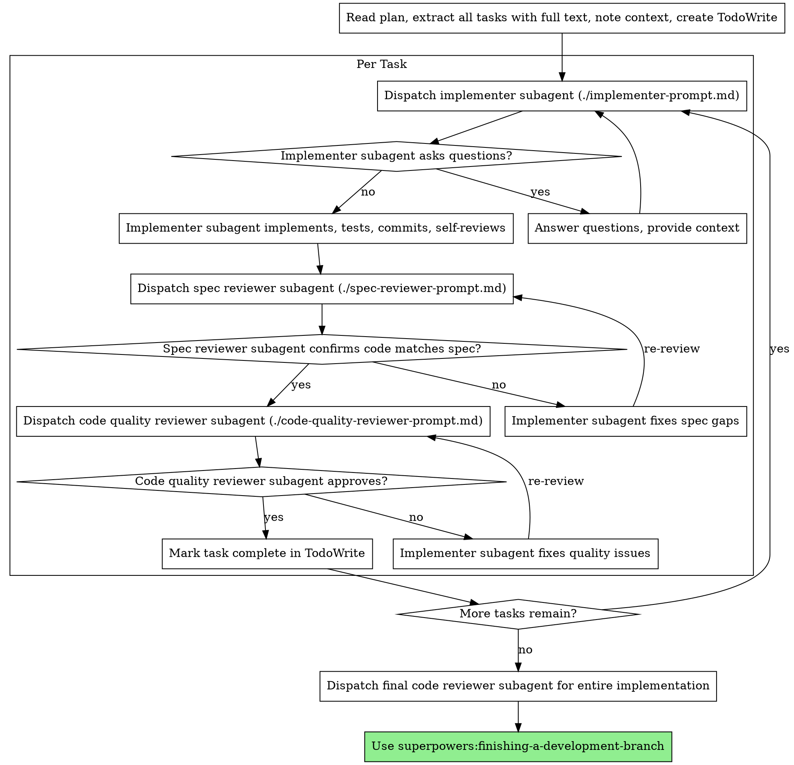

# Subagent-Driven Development

Execute plan by dispatching fresh subagent per task, with two-stage review after each: spec compliance review first, then code quality review. Supports **parallel mode** for truly independent tasks using worktree-isolated agents.

**Core principle:** Fresh subagent per task + two-stage review (spec then quality) = high quality, fast iteration
**Parallel principle:** Independent tasks + worktree isolation + post-implementation review = speed without sacrificing quality

## When to Use



**Mode selection:**
- **Sequential mode** (default): Tasks run one at a time with review gates between each. Use when tasks share files or have ordering dependencies.
- **Parallel mode**: All independent tasks launch simultaneously in isolated worktrees, then reviews run after all complete. Use when tasks touch completely different files with no dependencies.

**vs. Executing Plans (parallel session):**
- Same session (no context switch)
- Fresh subagent per task (no context pollution)
- Two-stage review after each task: spec compliance first, then code quality
- Faster iteration (no human-in-loop between tasks)

## The Process



## Parallel Mode

When ALL tasks are fully independent (no shared files, no ordering constraints), use parallel mode to launch all implementers simultaneously, then review after all complete.

### Step 1: Dependency Analysis

Before proposing parallel mode, verify independence:

```
For each pair of tasks, check:
- Do they modify the same files? -> NOT independent
- Does one depend on another's output? -> NOT independent
- Do they share database tables/schemas? -> CAUTION (may conflict)
- Do they touch different modules entirely? -> Independent
```

If ANY dependency exists, fall back to sequential mode for the dependent tasks. You can mix modes: parallel for independent tasks, sequential for dependent ones.

### Step 2: Present Plan and Get Confirmation

Show the user which tasks will run in parallel and why they're safe to parallelize:

```
Parallel mode: 4 independent tasks identified

  Task 1: Add user avatar upload (touches: src/avatar/*)
  Task 2: Fix pagination bug (touches: src/pagination/*)
  Task 3: Add rate limiting middleware (touches: src/middleware/*)
  Task 4: Update email templates (touches: templates/*)

No shared files detected. Each task gets its own worktree.
Proceed with parallel execution?
```

**Always get user confirmation before launching parallel mode.**

### Step 3: Launch All Implementers

Dispatch ALL implementer agents in a **single message** using the Agent tool with worktree isolation:

```
For each task, dispatch Agent with:
  - description: "Implement Task N: [name]"
  - prompt: [full task text from ./implementer-prompt.md template]
  - isolation: "worktree"
  - run_in_background: true
```

**Critical:** All Agent calls must be in a single message to maximize parallelism. Each agent gets its own worktree branch automatically — no file conflicts possible.

### Step 4: Collect Results

As background agents complete, collect their results. Track:
- Which tasks completed successfully
- Which tasks had questions (re-dispatch with answers)
- Which tasks failed (investigate and re-dispatch)

### Step 5: Sequential Reviews (Non-Negotiable)

After ALL implementers complete, run the standard two-stage review for EACH task's changes:

1. **Spec compliance review** - dispatch spec reviewer per task (can run these in parallel too since they're read-only)
2. **Fix spec issues** - dispatch fix agents if needed
3. **Code quality review** - dispatch quality reviewer per task (also parallelizable)
4. **Fix quality issues** - dispatch fix agents if needed
5. **Final cross-task review** - one reviewer checks all changes together for integration issues

The reviews CANNOT be skipped just because tasks ran in parallel. Parallel mode saves time on implementation, not on quality gates.

### Step 6: Merge Worktree Branches

After all reviews pass, merge each worktree branch back to the working branch:

```bash
# For each completed task worktree:
git merge --no-ff <worktree-branch>
```

Then clean up worktrees:

```bash
git worktree remove <worktree-path>
```

### Parallel Mode Example

```
You: I'm using Subagent-Driven Development (parallel mode) for this plan.

[Read plan: 4 tasks identified]
[Dependency analysis: all touch different modules]
[Present parallel plan to user]

User: "Go for it"

[Dispatch 4 implementer agents in single message, all with isolation: "worktree"]
  - Agent 1: "Implement Task 1: avatar upload" (background)
  - Agent 2: "Implement Task 2: fix pagination" (background)
  - Agent 3: "Implement Task 3: rate limiting" (background)
  - Agent 4: "Implement Task 4: email templates" (background)

[Agent 2 completes first]
Agent 2: Implemented pagination fix, 3/3 tests passing, committed.

[Agent 4 completes]
Agent 4: Updated all 6 templates, snapshot tests passing, committed.

[Agent 1 completes]
Agent 1: Avatar upload working, integration test passing, committed.

[Agent 3 completes with question]
Agent 3: "Should rate limit be per-user or per-IP?"

You: "Per-user for authenticated, per-IP for anonymous"

[Re-dispatch Agent 3 with answer]
Agent 3: Implemented dual rate limiting, 5/5 tests passing, committed.

[All 4 complete - begin reviews]

[Dispatch 4 spec reviewers in parallel]
Spec reviewer 1: ✅  |  Spec reviewer 2: ✅  |  Spec reviewer 3: ✅  |  Spec reviewer 4: ❌ Missing mobile template

[Fix Task 4, re-review]
Spec reviewer 4: ✅

[Dispatch 4 code quality reviewers in parallel]
All 4: ✅ Approved

[Dispatch cross-task integration reviewer]
Integration reviewer: ✅ No conflicts, clean integration

[Merge all worktree branches, clean up worktrees]

Done! 4 tasks completed in parallel.
```

## Prompt Templates

- `./implementer-prompt.md` - Dispatch implementer subagent
- `./spec-reviewer-prompt.md` - Dispatch spec compliance reviewer subagent
- `./code-quality-reviewer-prompt.md` - Dispatch code quality reviewer subagent

## Example Workflow

```
You: I'm using Subagent-Driven Development to execute this plan.

[Read plan file once: docs/plans/feature-plan.md]
[Extract all 5 tasks with full text and context]
[Create TodoWrite with all tasks]

Task 1: Hook installation script

[Get Task 1 text and context (already extracted)]
[Dispatch implementation subagent with full task text + context]

Implementer: "Before I begin - should the hook be installed at user or system level?"

You: "User level (~/.config/superpowers/hooks/)"

Implementer: "Got it. Implementing now..."
[Later] Implementer:
  - Implemented install-hook command
  - Added tests, 5/5 passing
  - Self-review: Found I missed --force flag, added it
  - Committed

[Dispatch spec compliance reviewer]
Spec reviewer: ✅ Spec compliant - all requirements met, nothing extra

[Get git SHAs, dispatch code quality reviewer]
Code reviewer: Strengths: Good test coverage, clean. Issues: None. Approved.

[Mark Task 1 complete]

Task 2: Recovery modes

[Get Task 2 text and context (already extracted)]
[Dispatch implementation subagent with full task text + context]

Implementer: [No questions, proceeds]
Implementer:
  - Added verify/repair modes
  - 8/8 tests passing
  - Self-review: All good
  - Committed

[Dispatch spec compliance reviewer]
Spec reviewer: ❌ Issues:
  - Missing: Progress reporting (spec says "report every 100 items")
  - Extra: Added --json flag (not requested)

[Implementer fixes issues]
Implementer: Removed --json flag, added progress reporting

[Spec reviewer reviews again]
Spec reviewer: ✅ Spec compliant now

[Dispatch code quality reviewer]
Code reviewer: Strengths: Solid. Issues (Important): Magic number (100)

[Implementer fixes]
Implementer: Extracted PROGRESS_INTERVAL constant

[Code reviewer reviews again]
Code reviewer: ✅ Approved

[Mark Task 2 complete]

...

[After all tasks]
[Dispatch final code-reviewer]
Final reviewer: All requirements met, ready to merge

Done!
```

## Advantages

**vs. Manual execution:**
- Subagents follow TDD naturally
- Fresh context per task (no confusion)
- Parallel-safe (subagents don't interfere)
- Subagent can ask questions (before AND during work)

**vs. Executing Plans:**
- Same session (no handoff)
- Continuous progress (no waiting)
- Review checkpoints automatic

**Efficiency gains:**
- No file reading overhead (controller provides full text)
- Controller curates exactly what context is needed
- Subagent gets complete information upfront
- Questions surfaced before work begins (not after)

**Quality gates:**
- Self-review catches issues before handoff
- Two-stage review: spec compliance, then code quality
- Review loops ensure fixes actually work
- Spec compliance prevents over/under-building
- Code quality ensures implementation is well-built

**Parallel mode gains:**
- All independent tasks execute simultaneously (wall-clock time = slowest task, not sum of all tasks)
- Worktree isolation eliminates file conflicts without manual coordination
- Reviews can also run in parallel (spec reviewers are read-only)
- Cross-task integration review catches issues that per-task reviews miss
- Graceful fallback: if dependency detected mid-flight, pause and switch to sequential

**Cost:**
- More subagent invocations (implementer + 2 reviewers per task)
- Controller does more prep work (extracting all tasks upfront)
- Review loops add iterations
- Parallel mode adds cross-task integration review
- But catches issues early (cheaper than debugging later)

## Red Flags

**Never:**
- Start implementation on main/master branch without explicit user consent
- Skip reviews (spec compliance OR code quality)
- Proceed with unfixed issues
- Dispatch multiple implementation subagents in parallel WITHOUT worktree isolation (conflicts)
- Use parallel mode when tasks share files or have dependencies
- Skip dependency analysis before choosing parallel mode
- Skip user confirmation before launching parallel mode
- Skip the cross-task integration review after parallel mode completes
- Make subagent read plan file (provide full text instead)
- Skip scene-setting context (subagent needs to understand where task fits)
- Ignore subagent questions (answer before letting them proceed)
- Accept "close enough" on spec compliance (spec reviewer found issues = not done)
- Skip review loops (reviewer found issues = implementer fixes = review again)
- Let implementer self-review replace actual review (both are needed)
- **Start code quality review before spec compliance is ✅** (wrong order)
- Move to next task while either review has open issues

**If subagent asks questions:**
- Answer clearly and completely
- Provide additional context if needed
- Don't rush them into implementation

**If reviewer finds issues:**
- Implementer (same subagent) fixes them
- Reviewer reviews again
- Repeat until approved
- Don't skip the re-review

**If subagent fails task:**
- Dispatch fix subagent with specific instructions
- Don't try to fix manually (context pollution)

## Integration

**Required workflow skills:**
- **superpowers:using-git-worktrees** - REQUIRED: Set up isolated workspace before starting
- **superpowers:writing-plans** - Creates the plan this skill executes
- **superpowers:requesting-code-review** - Code review template for reviewer subagents
- **superpowers:finishing-a-development-branch** - Complete development after all tasks

**Subagents should use:**
- **superpowers:test-driven-development** - Subagents follow TDD for each task

**Alternative workflow:**
- **superpowers:executing-plans** - Use for parallel session instead of same-session execution
